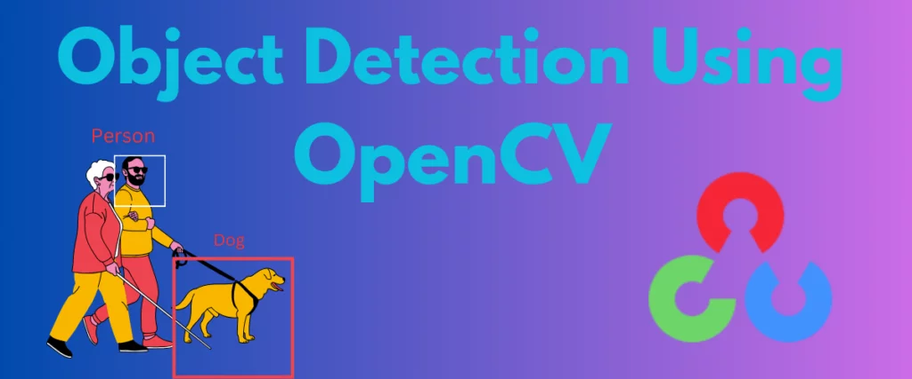

# Real-Time Object Detection Application Using OpenCV and Flask



An advanced Flask web application that combines real-time video streaming with AI-powered object detection and analysis. This platform leverages Google's Gemini vision model to provide intelligent analysis of live video feeds, making it perfect for real-time object detection and scene understanding.

## Key Features

- **Real-Time Video Streaming**: Efficient webcam feed with thread-safe frame delivery
- **AI-Powered Detection**: Integration with Google's Gemini vision model for advanced scene analysis
- **Interactive Interface**: Modern, responsive web UI built with Tailwind CSS
- **Real-Time Analysis**: Instant AI responses to queries about detected objects
- **Chat Context**: Maintains conversation history for more contextual responses
- **Comprehensive Logging**: Detailed error tracking and performance monitoring

## Technical Requirements

- Python 3.8+
- Webcam access
- Google API key (for Gemini model)
- OpenAI API key (for text-to-speech)

## Installation

1. Clone the repository:

```bash
git clone https://github.com/Abunuman/Real-Time-ODS.git
cd realtime-object-detection
```

2. Set up virtual environment:

```bash
python -m venv venv
source venv/bin/activate  # Windows: venv\Scripts\activate
```

3. Install dependencies:

```bash
pip install -r requirements.txt
```

4. Configure environment variables:

```bash
# Create .env file and add your API keys
GOOGLE_API_KEY=your_google_api_key
OPENAI_API_KEY=your_openai_api_key
```

## Project Structure

```
project/
├── app.py              - Main Flask application
├── templates/
│   └── index.html     - Web interface
├── requirements.txt    - Dependencies
├── .env               -Environment variables
└── README.md          - Documentation
```

## Core Components

### 1. Video Capture System

- Thread-safe webcam frame capture
- Efficient frame buffering
- Automatic resource management

### 2. AI Assistant Integration

- Real-time frame analysis
- Natural language processing
- Context-aware responses

### 3. Web Interface

- Live video display
- Query input system
- Real-time response display

## Usage Guide

1. **Starting the Application**:

```bash
python app.py
```

2. **Accessing the Interface**:

- Open browser: `http://localhost:5000`
- Grant webcam permissions when prompted

3. **Interacting with the System**:

- Enter questions about what you see
- Receive real-time AI analysis
- View detected objects and scene descriptions

## Development Features

- **Error Handling**: Comprehensive exception management
- **Resource Management**: Automatic cleanup of system resources
- **Threading**: Thread-safe operations for video capture
- **Logging**: Detailed system logging for debugging

## API Integration

### Google Gemini

- Visual analysis capabilities
- Natural language understanding
- Real-time image processing

### OpenAI (Optional)

- Text-to-speech functionality
- Enhanced language processing

## Optimization Tips

1. **Video Stream**:

- Adjust frame rate for performance
- Configure resolution based on needs
- Implement frame buffering

2. **AI Processing**:

- Batch processing when applicable
- Cache frequent responses
- Optimize query patterns

## Troubleshooting

Common issues and solutions:

1. **Video Feed Issues**

- Check webcam permissions
- Verify device connections
- Update video drivers
- Ensure no other applications are using the webcam

2. **AI Response Delays**

- Check internet connectivity
- Verify API key validity
- Monitor system resources
- Monitor system resources
- Check Python process CPU usage

3. **Interface Problems**

- Verify Flask server is running
- Check Python error logs
- Ensure all required dependencies are installed
- Confirm correct port availability (default 5000)

## Security Considerations

- Secure API key storage
- Input validation
- Resource limitation
- Session management
- Cross-site scripting protection

## Future Enhancements

1. **Technical Features**

- Multiple camera support
- Custom detection models
- Video recording capability
- Analytics dashboard

2. **User Interface**

- Custom detection zones
- Alert configurations
- Historical data view
- Export capabilities

## Contributing

1. Fork the repository
2. Create a feature branch
3. Commit your changes
4. Push to the branch
5. Create a Pull Request

## Support

For support:

1. Check existing issues
2. Create detailed bug reports
3. Include system information
4. Provide reproducible steps

## Acknowledgments

- Flask framework
- Google Gemini AI
- OpenCV project
- OpenAI services
- Tailwind CSS team

---

**Project maintained by Toyyib Muhammad-Jamiu**

_Last Updated: 29-11-2024._
